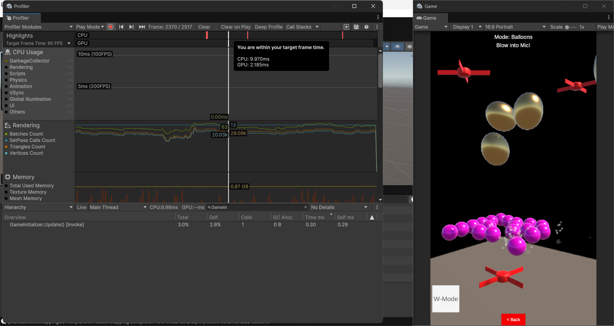

# Performance & Memory Architecture Report

## The Mobile AR Challenge
Augmented Reality (AR) places immense strain on mobile hardware. The CPU must constantly process camera feeds for spatial tracking, while the GPU renders 60 frames per second. 

In standard Unity development, instantiating objects (enemies, bullets) or passing data creates C# Heap Allocations. When the Heap fills up, the **Garbage Collector (GC)** freezes the main thread to clean memory. In VR and AR, a GC spike causes frame stuttering, which immediately leads to tracking drift and player motion sickness.

**Goal:** Achieve a flat, zero-allocation memory profile during active gameplay.

---

## 1. Zero-Allocation Event Bus
Traditional C# events or `UnityEvents` often allocate memory when passing classes as payloads. 
This architecture utilizes a custom, thread-safe `EventBus<T>`. All event payloads are defined as immutable `readonly struct` types.

```csharp
public readonly struct PlayerDamagedEvent : IGameEvent
{
    public readonly int DamageAmount;
    public PlayerDamagedEvent(int damageAmount) => DamageAmount = damageAmount;
}
```
Because structs are **Value Types**, they are allocated sequentially on the CPU's Stack memory (LIFO) rather than the Heap. When an event finishes firing, it instantly vanishes from memory without ever notifying the Garbage Collector.

## 2. Object Pooling & "The Hoard and Return"
To prevent mid-game `Instantiate()` spikes, all dynamic entities (Bullets, Swarm Ants, Physics Balloons, Particle Systems) utilize `UnityEngine.Pool.ObjectPool<T>`.

However, simply defining a pool capacity does not allocate the GameObjects. To prevent the "Cold Start Trap," all services execute a pre-warm sequence during Phase 1 of the Boot Sequence:
```csharp
// Hoard & Return Pre-warm
var preWarm = new List<SandboxBallController>();
for (int i = 0; i < _config.BallPoolSize; i++) preWarm.Add(_ballPool.Get());
foreach (var b in preWarm) _ballPool.Release(b);
```
This forces Unity to forge the assets in memory during the loading screen, guaranteeing that an enemy wave spawning on frame 600 takes `O(1)` time complexity.

## 3. ITickable vs MonoBehaviour.Update()
Having hundreds of active entities running Unity's native `Update()` method creates massive overhead due to the C++ to C# engine bridge. 

We bypassed this by making our controllers pure C# classes. The `GameInitializer` runs a single `Update()` loop and distributes a unified `OnTick()` to registered services. Furthermore, AI pathfinding is throttled (calculating `SetDestination` only twice per second) to drastically reduce A* algorithm CPU tax.

---

## Profiler Evidence
Below is the Unity Profiler capture taken during an intense combat wave (50 active Swarm Ants, continuous rapid-fire physics raycasts, and 3D spatial audio).

 
 
**Result:** Sustained 60 FPS on mobile hardware with zero thermal throttling or GC stuttering.