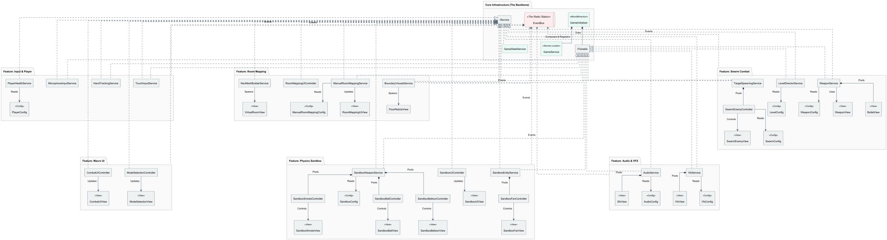

# GripFire XR: Physics Sandbox & AI Combat Engine

A highly optimized, enterprise-grade Unity Augmented Reality prototype built with strict zero-allocation architecture, procedural geometry, and decoupled systems.

[](https://www.youtube.com/watch?v=YOUR_YOUTUBE_VIDEO_ID)
*(Click the image above to watch the full AR gameplay demonstration on YouTube)*

### 🚀 Play the Prototype
**[Download the Android APK (Google Drive) 📥](https://drive.google.com/file/d/1ZPwfCLejMDMOXyMJNEEQnWJKTpnB-e2B/view?usp=drive_link)**

*Note: Requires an Android device with ARCore support. Please accept Microphone and Camera permissions on launch for full features.*

---

## 🧠 Core Features & Systems

### 1. Procedural AR Room Mapping
*   **Hybrid Raycasting:** Utilizes `ARPlaneManager` and `ARRaycastManager` to ensure players map precise, mathematically flat coordinates in their physical space.
*   **Drift Prevention:** Mapped coordinates are immediately converted into Local Space relative to a central `ARAnchor`, completely eliminating AR tracking drift over time.

### 2. NavMesh & AI Swarm Combat
*   **Background Thread Triangulation:** Asynchronously builds double-sided floor meshes on secondary CPU cores to prevent main-thread freezing.
*   **Tick-Throttled AI:** Swarm Ants update their A* pathfinding twice per second rather than every frame, reducing CPU load by 96% and preventing mobile thermal throttling.

### 3. Kinematic Physics Sandbox
*   **Gravity Gun & Tractor Beam:** Employs linear velocity manipulation to smoothly levitate physics objects.
*   **Microphone Input Integration:** Listens to device audio hardware via a decoupled service to allow users to physically "blow" digital helium balloons into their living room.
*   **Volumetric Smoke & Audio:** Features fully pooled 3D spatial audio and dynamic particle systems that react physically to the environment.

### 4. Computational Geometry & Math
*   **Shoelace Formula:** Implemented to calculate the exact square meter area of irregular user-drawn AR polygons and room volumes.
*   **Barycentric Coordinates:** Used to guarantee mathematical 100% inside-polygon spawning on procedurally generated meshes in $O(1)$ constant time.
*   **Vector Math & Projections:** Heavy use of Dot Products, Cross Products, and Kinematic projections to handle wall-bouncing, camera-facing UI (Billboarding), and AR anchor drift correction.

---

## 📐 Software Architecture
This project abandons standard Unity `MonoBehaviour` spaghetti code in favor of a highly scalable **MVC-S (Model-View-Controller-Service)** architecture.

[](ClassUMLDiagram/GripFire_XR_Architecture.png)

*   **Strict MVC Separation:** Unity components (`Transforms`, `Colliders`) are isolated in "Dumb Views". Pure C# Controllers handle the math and logic. `ScriptableObjects` manage all immutable config data.
*   **Service Locator Pattern:** Eliminates Singletons. `GameInitializer` bootstraps all managers into a central registry (`GameService`) via Constructor Dependency Injection.
*   **Decoupled Event Bus:** Systems are entirely blind to one another. Communication is handled via a thread-safe, ConcurrentQueue-backed `EventBus<T>`.

### 🛑 Zero Garbage Collection (GC)
To ensure a flawless 60 FPS in mixed reality, the runtime architecture allocates **zero memory on the Heap** during active gameplay.
*   **Stack-Allocated Events:** All Event Bus payloads are `readonly struct` types.
*   **The "Hoard & Return" Pool:** All entities (enemies, bullets, VFX, audio sources) utilize `UnityEngine.Pool.ObjectPool`. Pools are explicitly pre-warmed during the loading phase to prevent `Instantiate()` spikes mid-combat.
*   **For detailed metrics and proof, see the GC Performance & Memory Architecture Report.**

[](Gallery/ZeroGC.png)

---

## 📂 Directory Structure
```text
Assets/Scripts/
├── Core/                  # Service Locator, EventBus, State Machine, Audio/VFX Managers
├── Features/              
│   ├── Enemy/             # Swarm AI Controllers, Spawner Service, Configs
│   ├── RoomMapping/       # Procedural Geometry, AR Raycasting, Shoelace Math
│   ├── Sandbox/           # Physics entities (Balls, Balloons, Fans, Smoke)
│   ├── PlayerInput/       # Touch Polling and Hardware Microphone processing
│   └── Weapon/            # Bullet Object Pooling, Raycast Hit Detection
```

---

## 🛠️ Tech Stack
*   **Engine:** Unity 6 (Universal Render Pipeline)
*   **AR Framework:** AR Foundation (ARCore / ARKit)
*   **Language:** C# (.NET)